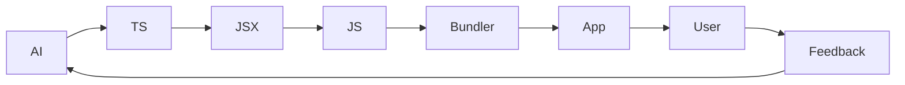

===/=== 
title: A Brief, Questionable History of Compilers 
date:2025-01-01 
presenter: Mrinmay 
description: How we went from punch cards to React spaghetti 
===/===


# Why Are We Here?

Programming history is messy.  
Developers are messier.  
Compilers tried to fix that.  
React undid all of it (with hooks).

```text
🤖  /|\
    /  Compiler: I tried my best
```

===


# In the Beginning: Machine Code

Computers spoke in numbers.  
Humans pretended they understood.  
Bugs were real insects.  
Tweezers were debugging tools.  
Comments were a luxury.

```asm
[01001001]   // actual program
// 🐞: Found in hardware
```

===


# Then Came Assembly

Slightly better than raw numbers.  
Still painful to read.  
Goto everywhere.  
Labels had trust issues.  
Macros were magic.

```asm
LOOP:  MOV A, B   ; copy B to A
    JMP LOOP   ; infinite fun
// Trust issues: where does it end?
```

===


# Grace Hopper Saves the Day

Idea: code in something readable.  
Result: COBOL.  
Enterprises still depend on it.  
No one admits writing it.  
COBOL: the language that never retires.

```text
+-------+
| COBOL |
|forever|
+-------+
// "It just works" — some mainframe
```

===

# The Rise of C

More control for humans More ways to crash machines Pointers caused fear
Undefined behavior ruled

```char* chaos = NULL; *chaos = 42;```

===

# The Great Language Explosion

Everyone created a language Half were variants of Lisp The rest argued
about braces Compilers aged rapidly

```(((too many parentheses)))```

===

# Java Tries to Bring Order

Write once Debug everywhere Bytecode ruled the JVM Opinions multiplied

```[ JAVA ] / / Bugs Classes```

===


# avaScript Sneaks In

Meant for tiny browser tricks.  
Named in 10 days.  
Suddenly ran the world.  
Async confusion spread like wildfire.  
"var" everywhere, hoisting hopes and dreams.  
Compilers lost sleep, and so did developers.  
ES6 arrived, but so did more frameworks.  
The web was never the same.

```js
// 1995: Just a little script
alert('Hello, world!');
// 2025: Now runs your bank, fridge, and car
async function everything() { await chaos(); }
```

===

# Enter Build Tools

Browsers lagged behind.  
Developers raced ahead.  
Webpack emerged, armed with runes and rituals.  
Configs made grown engineers cry.  
Minifiers, transpilers, bundlers, oh my!  
900-line configs, 9,000 dependencies.  
"It works on my machine" became a lifestyle.  
Builds broke on Fridays, and Mondays, and...

```js
// webpack.config.js
module.exports = {
    entry: 'hope.js',
    output: { filename: 'bundle.js' },
    // ...somewhere, a developer weeps
}
// npm run build: pray
```

===

# React Arrives

HTML inside JavaScript.  
JavaScript inside HTML.  
State everywhere, all at once.  
Components nested like Russian dolls.  
Hooks, context, suspense, portals—oh my!  
Compilers questioned reality.  
"Just a UI library"—but it changed everything.  
Developers learned to love (and fear) re-renders.

```jsx
function App() {
    const [existential, setExistential] = useState(true);
    return (
        <div>
            {existential ? 'Why?' : 'How?'}
        </div>
    );
}
// JSX: JavaScript eXistential Crisis
```

===

# The Modern Toolchain

Vite arrived with speed.  
Turbopack followed, promising more.  
Builds became faster, but configs stayed mysterious.  
Hot reloads, cold coffee.  
Plugins for everything, docs for nothing.  
CI/CD pipelines as long as novels.  
"Just one more tool"—said everyone, always.  
Confusion stayed the same, but so did the fun.

```sh
# Fast build, faster confusion
vite build && echo "Did it work?"
# If not, try deleting node_modules
```

===

# The Future

More layers on layers.  
Compilers for compilers.  
React code generating more code.  
AI writing TypeScript, TypeScript writing JSX, JSX writing JS, JS writing bugs.  
History repeats, but with more flair.  
Maybe, just maybe, the next tool will make it simple.  
Or maybe, we'll just keep building.  
But now, we have memes, and hope.



===

# Final Thoughts

Compilers tried to help.  
Developers added chaos.  
React made both infinite.  
But every new tool brings new hope.  
We keep building, learning, and laughing.  
The cycle continues—brighter, faster, and maybe, just maybe, better.

```text
[order] -> [chaos] -> [React] -> [repeat]
// ...and [hope]
```
